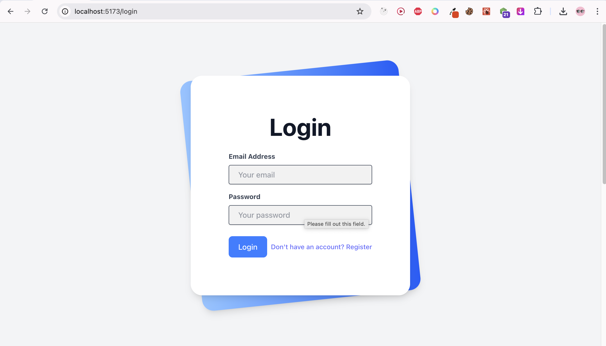
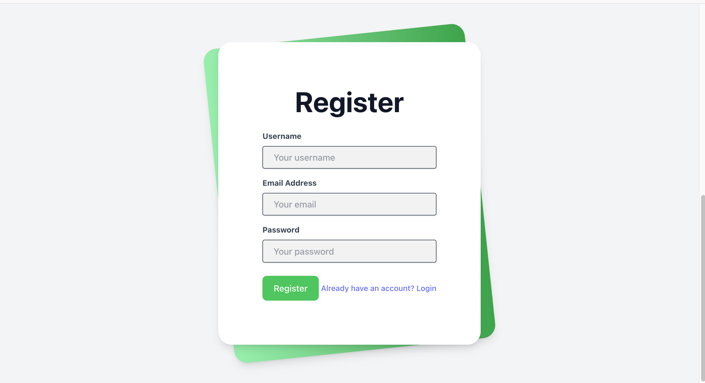
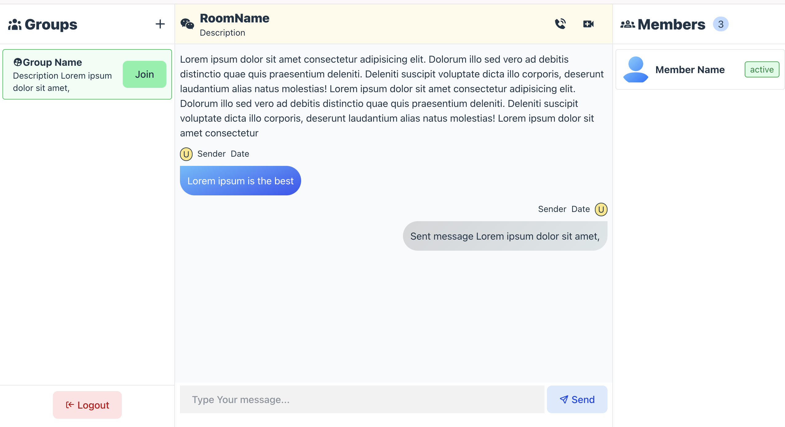

# SOCKET-CHAT-APP

This project aims to demonstrate the utilization of socket.io in chat application.

## Tools and Libraries used

- [vite](https://vite.dev/guide/) for creating react project
- [express](https://expressjs.com/en/starter/installing.html) for backend framework
- [socket.io](https://socket.io) for bidirectional event based communication (chatting)
- [react-router-dom](https://reactrouter.com/home) for routing pages
- [mongoose](https://www.mongodb.com/developer/languages/javascript/getting-started-with-mongodb-and-mongoose/) for database (no-sql)
- [nodemon](https://www.npmjs.com/package/nodemon) for auto restarting the server
- [cors](https://www.npmjs.com/package/cors) middleware is needed when your frontend and backend are hosted on different domains, ports, or protocols
- [envalid](https://www.npmjs.com/package/envalid) for validating and accessing enviroment variables
- [bcrypt](https://www.npmjs.com/package/bcrypt) for hashing password
- [http-errors]() for handling http errors

## Screenshots

### 🔐 Login Page

### 📝 Register Page

### 🛠️ Admin Page

